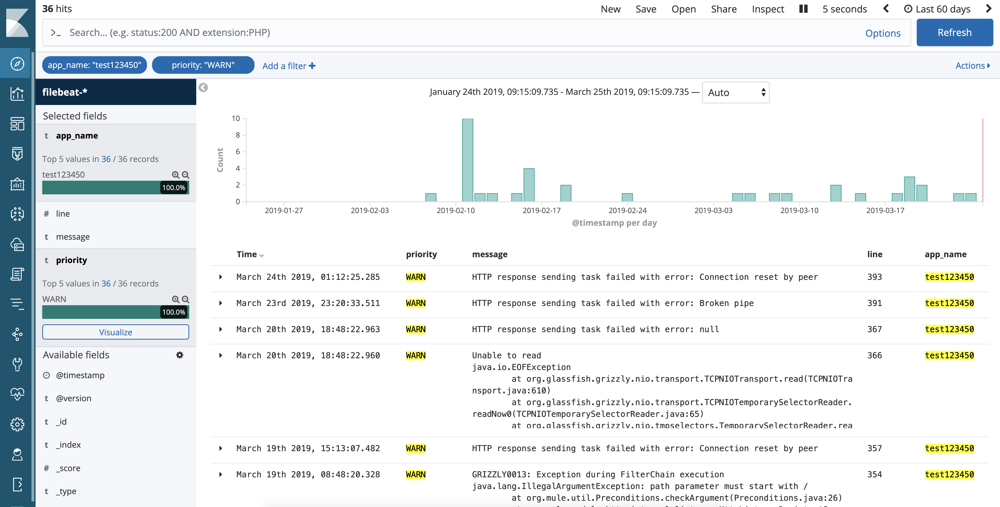
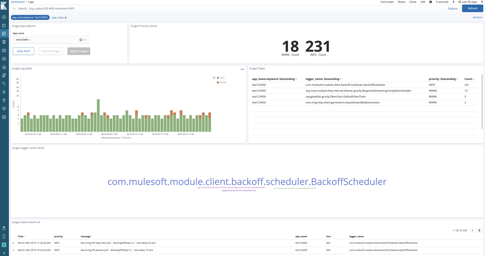

# elastic-cloudhub-observability
Experiments with observability of Mule components and APIs deployed into CloudHub using Elastic stack.

This pipeline config authenticates to CloudHub and performs synchronisation of all application logs for a particular environment.



#### Initialising Kibana
Go to Management => saved objects and import the following 3 files to initialise all Kibana objects:
```
kibana/apis_dashboard.json
kibana/apps_dashboard.json
kibana/logs_dashboard.json
```

#### Command to run:
```sh
cd elastic-cloudhub-observability

ES_USER=elastic \
ES_HOST=https://eshost:9200 \
ES_PASS=espass \
CH_USER=cloudhubuser \
CH_PASSWORD=cloudhubpassword \
CH_ENV=Production \
NUM_LOG_LINES=300 \
logstash --path.settings $PWD/logstash/config
```
